# Trivia Me This

  Capital One Winter Summit
   
   

<!-- Link to depolyed website: http://trivia.kev-chen.me/ -->

<!-- Link to GitHub repository: https://github.com/kevin-chen/trivia-web-app -->

## Prompt

To build a web app to find trivia questions by category, time, and difficulty

To complete this challenge, build a web application that:
* has a search function that displays results in an intuitive, responsive, mobile friendly, easy to navigate interface.
* gives users the ability to refine search results by:
  * date or timeframe aired (you can search by a day,  a week, a month)
  * trivia category
  * level of difficulty of the question
  * any other smart searching criteria you see fit

Optional: You may want to include these bonus features:

* Game board simulation with the categories and questions in the proper place (as it would be organized in the game with easier questions on top)
* Marking or saving questions into a "favorites" collection

Time spent: **15** hours spent in total

## User Features

The following **required** functionality is completed:

- [X] Searching page with search function displayed search results page
- [X] Ability to search with filters (category, airdate, difficulty)

The following **bonus** features are implemented:

- [X] Audio background music
- [X] Trivia game with scorekeeping
- [X] Automatic dropdown category search
- [X] Banner notifications (search successful, game response)
- [X] Sample random trivia questions on homepage
- [X] Specific trivia questions by category, airdate, and difficulty
- [X] UI Design (Flipping Cards)
- [X] Learn more button for each trivia card

## Future Features

- [ ] Make menu options more asthetic
- [ ] Make website more dynamic in other platforms (mobile and web)
- [ ] Improve searching algorithm

## Searching Algorithm:

In order to search through the many categories that JService provides, the application first searches through all the possible categories using the /Categories endpoint with a HTTP Request to get JSON trivia information from JService. While the program is searching through each matching category, it looks through the questions/clues of that category for other search filters such as date/timeframe aired and level of difficulty. If these criteria are a match, the clues are appended to a list which would be displayed on the search results page.

# Technologies Utilized

* Python and the web framework, Django to organize the project, redirect between pages, send requests with the JService endpoint, filter trivia questions by category, airdate, and level of difficulty

* HTML & CSS to display web pages with Bootstrap designs and allows user interactions

* JavaScript to develop a small trivia game, control audio features, and provide support for category search dropdown

## Video Walkthrough

Here's a walkthrough of implemented user functions:

 

## Features

### Home Page

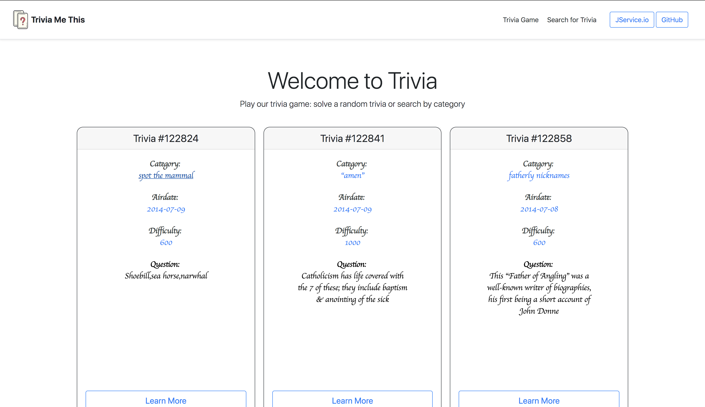 

### Game Page

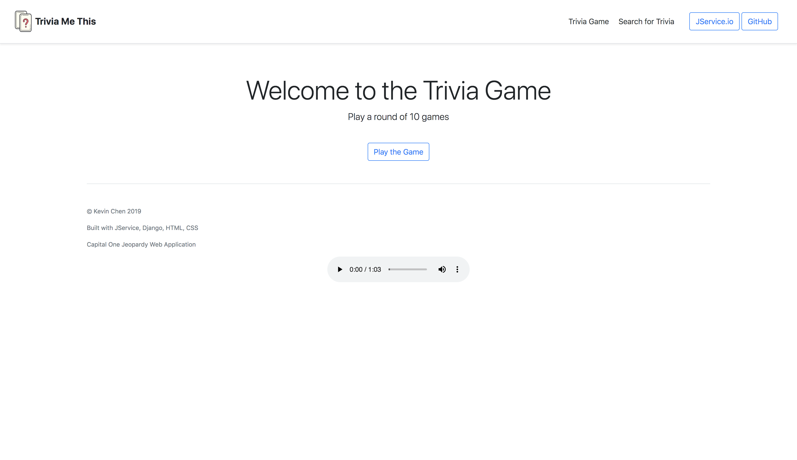 

### Search Page

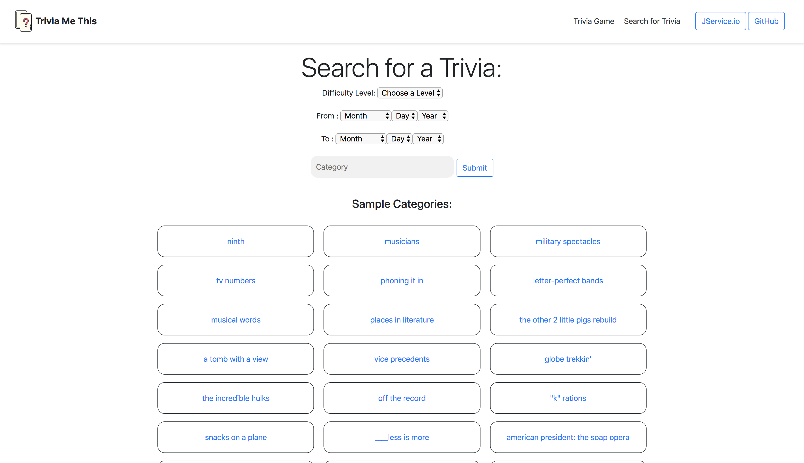 

### Search Results

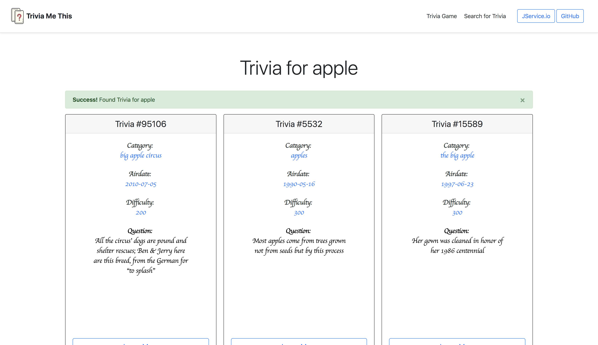 

## Journey

### First

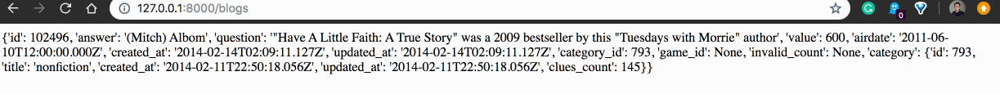 

### Second

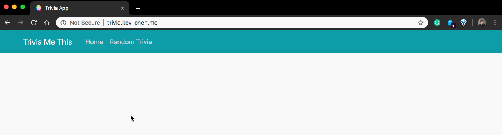 

### Third

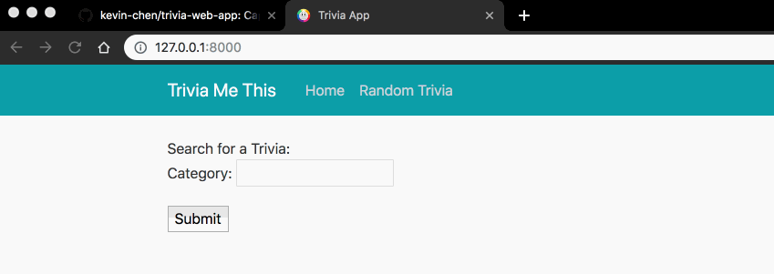 

### Fourth

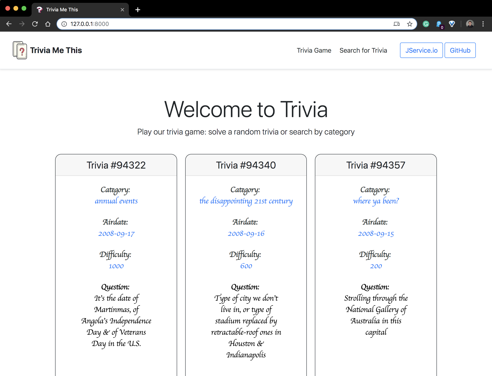 

### Fifth

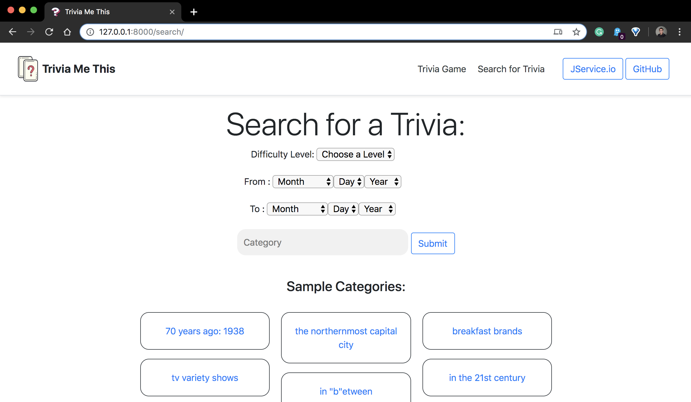 

### Sixth

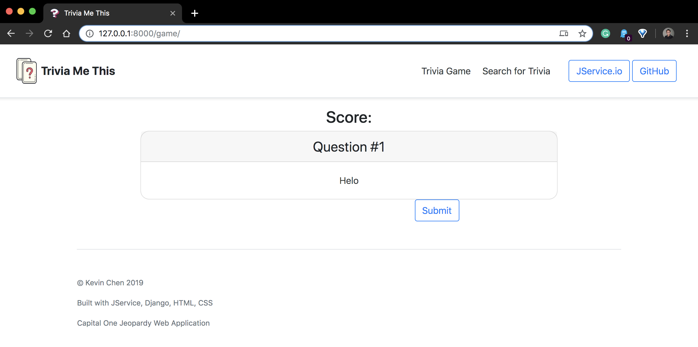 

### Seventh

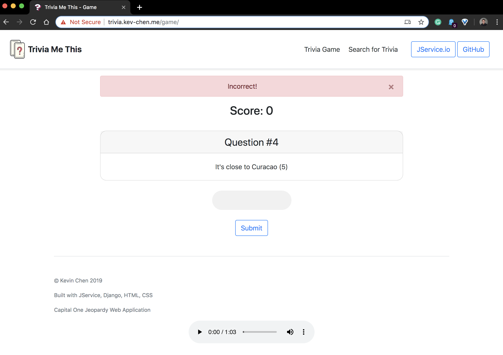 
